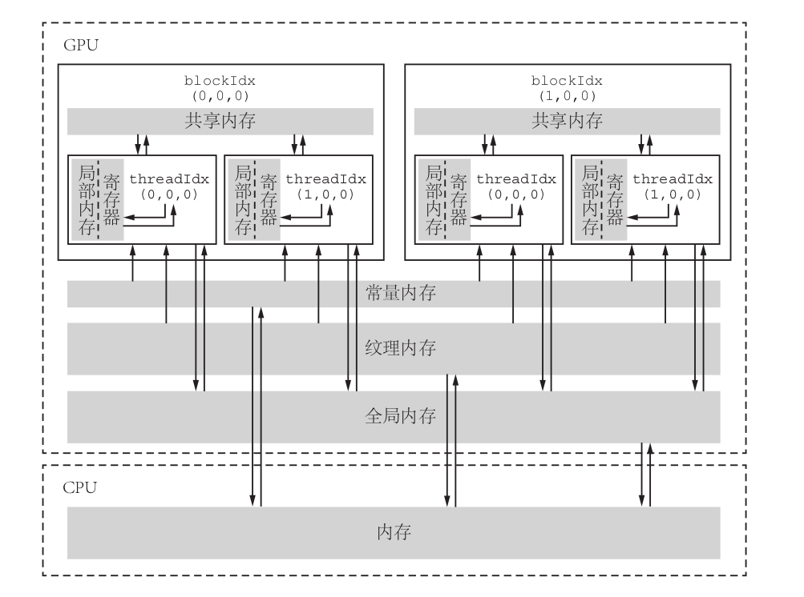
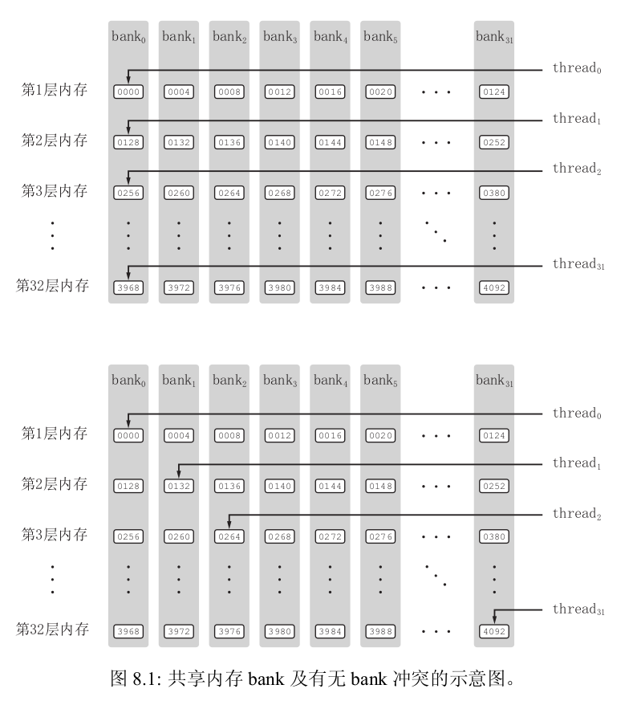
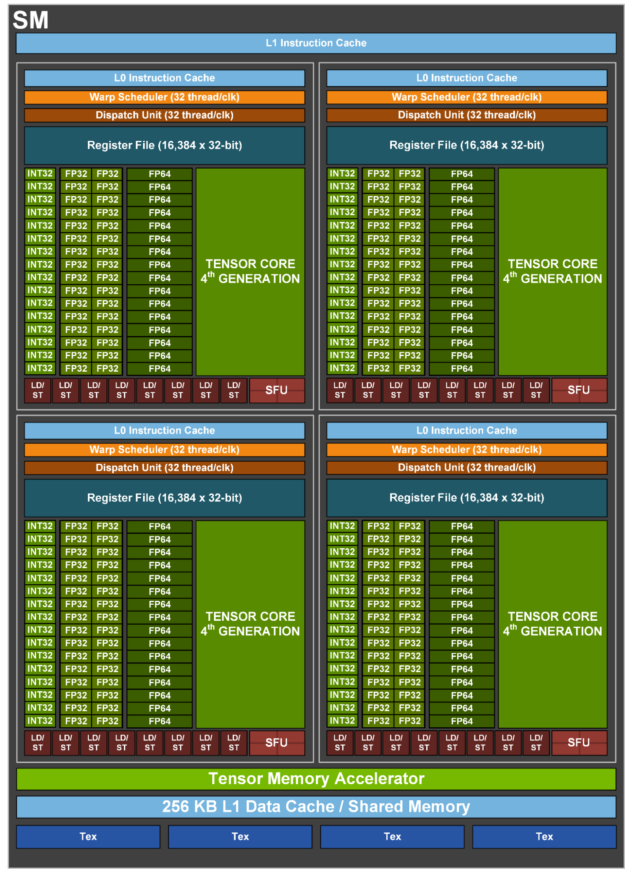

* GPU计算不是指单独的GPU计算，而是指CPU+GPU的异构计算，GPU必须在CPU的调度下才能完成特定任务。
* 起控制作用的CPU称为主机（host），起加速作用的GPU称为设备（device）。
* 主机对设备的调用是通过核函数（kernel function）来实现，
* 一个典型的，简单的CUDA程序的结构
  * `int main() { 主机代码; 核函数的调用; 主机代码}`
* 核函数必须被`__global__`修饰，核函数的返回类型必须是`void`，限定符`__global__`和`void`的次序可随意
* `cudaDeviceSynchronize`的作用是同步主机与设备

* CUDA对能够定义的网格大小和线程块大小做了限制，网格大小在x,y,z三个方向的最大允许值是2^31 - 1, 65535, 65535;线程块大小在x,y,z这三个方向的最大允许值分别是1024,1024和64。另外还要求线程块总的大小，即blockDim.x，blockDim.y,blockDim.z的乘积不能大于1024，也就是说，不管如何定义，一个线程块最多只能有1024个线程。
* 一个线程块中的线程可以细分为不同的线程束（thread warp），一个线程束是同一个线程块中相邻的warpSize个线程，warpSize的值是32，一个线程束就是连续的32个线程；

一个典型的CUDA程序的基本框架
```
头文件包含
常量定义（或者宏定义）
c++自定义函数和CUDA核函数的声明（原型）
int main(void)
{
        分配主机与设备内存
        初始化主机中的数据
        将某些数据从主机复制到设备
        调用核函数在设备中进行计算
        将某些数据从设备复制到主机
        释放主机与设备内存
}
c++自定义函数和CUDA核函数的定义（实现）
```

* 在CUDA中，设备内存的动态分配可由`cudaMalloc`函数实现
  * 函数原型如下`cudaError_t cudaMalloc(void **address, size_t size)`
* `cudaMalloc`函数分配的设备内存需要用`cudaFree()`函数释放
  * 函数原型如下`cudaError_t cudaFree(void *address)`
* `cudaError_t cudaMemcpy(void *dst, const void *src, size_t count, enum cudaMemcpyKind kind)`
  * 第一个参数dst是目标地址
  * 第二个参数src是源地址
  * 第三个参数count是复制数据的字节数
  * 第四个参数kind是枚举类型的变量，标志数据传递方向
    * cudaMemcpyHostToHost, 表示从主机复制到主机
    * cudaMemcpyHostToDevice,表示从主机复制到设备
    * cudaMemcpyDeviceToHost,表示从设备复制到主机
    * cudaMemcpyDeviceToDevice,表示从设备复制到设备
    * cudaMemcpyDefault,表示根据指针dst和src所指地址自动判断数据传输的方向

* 编写核函数时要注意的几点
  * 函数名无特殊要求，而且支持c++中的重载
  * 不支持可变数量的参数列表，参数的个数必须指定
  * 可以向核函数传递非指针变量，其内容对每个线程可见
  * 核函数不能成为一个类的成员，通常的做法是用一个包装函数调用核函数，而将包装函数定义为类的成员
  * 无论是从主机调用还是从设备调用，核函数都是在设备中执行，调用核函数必须指定执行配置，即三括号和它里面的参数
  * 除非使用统一内存编程机制，否则传递给核函数的数组（指针）必须指向设备内存

* 在CUDA程序中，由以下标识符确定一个函数在哪里被调用以及在哪里执行
  * 用`__global__`修饰的函数称为核函数，一般由主机调用，在设备中执行，如果使用动态并行，则也可以在核函数中调用自己或其他核函数
  * 用`__device__`修饰的函数称为设备函数，只能被核函数或其他设备函数调用，在设备中执行
  * 用`__host__`修饰的函数就是主机函数，在主机中被调用，在主机中执行。对于主机端的函数，该修饰符可省略。之所以提供这样的一个修饰符，是因为有时可以用`__host__`和`__device__`同时修饰一个函数，使得该函数既是一个c++的普通函数，又是一个设备函数
  * 不能同时用`__device__`和`__global__`修饰一个函数，即不能将一个函数同时定义为设备函数和核函数
  * 不能同时用`__host__`和`__global__`修饰一个函数，即不能将一个函数同时定义为主机函数和核函数
  * 编译器决定把设备函数当作内联函数或非内联函数，但可以用修饰符`__noinline__`建议一个设备函数为非内联函数，也可以用修饰符`__forceinline__`建议一个设备函数为内联函数
* 有一种方法可以捕捉调用核函数可能发生的错误，即在调用核函数之后加上如下两个语句
  * `CHECK(cudaGetLastError())`
  * `CHECK(cudaDeviceSynchronize())`
  * 第一个语句是捕捉第二个语句之前的最后一个错误，第二个语句的作用是同步主机与设备，因为核函数的调用是异步的，即主机发出调用核函数的命令后会立即执行后面的语句，不会等待核函数执行完毕

* CUDA提供CUDA-MEMCHECK工具
  * cuda-memcheck --tool memcheck [option] app_name [options]
  * cuda-memcheck --tool racecheck [option] app_name [options]
  * cuda-memcheck --tool initcheck [option] app_name [options]
  * cuda-memcheck --tool synccheck [option] app_name [options]
* 提高CUDA程序获得高性能的必要不充分条件
  * 减少主机与设备之间的数据传输
  * 提高核函数的算术强度
  * 增大核函数的并行规模



| 内存类型 | 物理位置 | 访问权限 | 可见范围 | 生命周期 |
| ------ | ------ | ------ | ------ | ------ |
| 全局内存 | 在芯片外 |可读可写 |所有线程和主机端|由主机分配和释放|
|常量内存|在芯片外|仅可读|所有线程和主机端|由主机分配和释放|
|纹理和表面内存|在芯片外|一般仅可读|所有线程和主机端|由主机分配和释放|
|寄存器内存|在芯片内|可读可写|单个线程|所在线程|
|局部内存|在芯片外|可读可写|单个线程|所在线程|
|共享内存|在芯片内|可读可写|单个线程块|所在线程块|

* <mark>全局内存</mark>的含义是核函数中的所有线程都能访问其中的数据，全局内存的主要角色是为核函数提供数据，并在主机和设备以及设备和设备之间传递数据，使用`cudaMalloc`函数为全局内存分配设备内存；全局内存对整个网络的所有线程可见，也就是说，一个网格的所有线程都可以访问（读或写）传入核函数的设备指针所指向的全局内存中的全部数据;全局内存的生命周期不是由核函数决定的，而是由主机端决定的，从使用`cudaMalloc`分配开始，到`cudaFree`释放内存结束；
* cuda允许使用静态全局内存变量，其所占的内存数量在编译期间就确定，静态全局内存变量必须在所有主机与设备函数外部定义，是一种“全局的静态全局内存变量”
* 静态全局内存变量由以下方式在任何函数外部定义
  * `__device__ T x;`
  * `__device__ T y[N];`
  * 修饰符`__device__`说明该变量是设备中的变量，而不是主机的变量；在核函数中，可直接对静态全局内存变量进行访问，并不需要将它们以参数的形式传给核函数；不可以在主机函数中直接访问静态全局内存变量，可以使用`cudaMemcpyToSymbol`和`cudaMemcpyFromSymbol`在静态全局变量和主机内存之间传输数据。
* <mark>常量内存</mark>是有常量缓存的全局内存，共有64KB，可见范围和生命周期与全局内存一致，不同的是，常量内存仅可读，不可写，拥有缓存，常量内存的访问速度比全局内存快，<mark>得到高访问速度的前提是一个线程束中的线程（一个线程块中的相邻的32个线程）要读取相同的常量内存数据</mark>；
* 在核函数外使用`__constant__`定义变量来使用常量内存
* 纹理内存和表面内存类似常量内存，是一种具有缓存的全局内存，有相同的可见范围和生命周期，一般仅可读，
* 在核函数中定义的不加任何限定符的变量一般来说就存放在寄存器中，核函数中定义的不加任何限定符的数组有可能存放在局部内存中，寄存器可读可写，寄存器变量仅仅被一个线程可见，寄存器的生命周期与所属线程的生命周期一致，从定义它开始，到线程消失时结束；
* 共享内存对整个线程块可见，生命周期与线程块一致；
* <mark>SM线程的执行是以线程束为单位的，最好将线程块的大小取为线程束大小（32个线程）的整数倍</mark>

* 全局内存的合理使用
  * 一次数据传输处理的数据量在默认情况下是32字节；
  * 对全局内存的访问将触发内存事务，即数据传输；
  * 全局内存的访问模式，有合并和非合并之分。合并访问指的是一个线程束对全局内存的一次访问请求（读或者写）导致最少量的数据传输，否则称访问是非合并的。可以定义一个合并度（degree of coalescing），等于线程束请求的字节数除以由该请求导致的所有数据传输处理的字节数，如果所有数据传输中处理的数据都是线程束所需要的，那么合并度就是100%，即对应合并访问。

* 在核函数中可以直接使用在函数外部由`#define`或`const`定义的常量，包括整型常量和浮点型常量，但是不能在核函数中使用这种常量的引用或地址；

* 共享内存是一种可被程序员直接操控的缓存，主要作用有两个：一个是减少核函数对全局内存的访问次数，实现高效的线程块内部的通信；另一个是提高全局内存访问的合并度。
* 如果需要保证核函数中语句的执行顺序与出现顺序一致，必须使用某种同步机制，在cuda中，使用`__syncthreads__`，这个函数只能使用在核函数中，该函数可保证一个线程块中的所有线程，在执行该语句后面的语句之前都完全执行了该语句前面的语句，然而，该函数只针对同一个线程块中的线程，不同线程块中线程的执行次序是不确定的。
* 在核函数中，使用`__shared__`将一个变量定义为共享内存变量；在一个核函数中定义一个共享内存变量，相当于在每一个线程块中有了一个该变量的副本，每个副本都不一样；
* 使用动态的共享内存
  * 在调用核函数的执行配置中设置第三个参数
    * `<<<grid_size, block_size, sizeof(real) * block_size>>>`，前两个参数是网格大小和线程块大小，第三个参数是核函数中每个线程块需要定义的动态共享内存的字节数；
    * 动态共享内存的声明方式：`extern __shared__`，不可以将动态共享内存数组声明为指针-->>`extern __shared__ real *s_y`这是错误的



* 避免共享内存的bank冲突
  * 为了获得高的内存带宽，共享内存在物理上被分为32个（刚好等于线程束的数量）同样宽度的，能同时访问的内存bank。可以将32个bank从0到31编号，在每一个bank中，可以对其中的内存地址从0开始编号，将所有bank中编号为0的内存称为第一层内存，将所有bank中编号为1的内存称为第二层内存，每个bank的宽度为4字节。
  * 对于bank宽度为4字节的架构，共享内存数组是按照如下方式线性的映射到内存bank的，共享内存数组中连续的128字节的内容分摊到32个bank的某一层中，每个bank负责4字节的内容。例如，对于一个长度为128的单精度浮点数变量的共享内存数组来说，第0-31个数组元素依次对应到32个bank的第一层，第32-63个数组元素依次对应到32个bank的第二层，第64-95个数组元素依次对应到32个bank的第三层，第96-127个数组元素依次对应到32个bank的第四层。
  * 只要同一个线程束中的多个线程不同时访问同一个bank中不同层的数据，该线程束对共享内存的访问就只需要一次内存事务，当同一个线程束的多个线程试图访问同一个bank的不同层的数据时，就会发生bank冲突。在一个线程束中对同一个bank的n层数据同时访问将导致n次内存事务，这种情况称为n路bank冲突。
  * 原子函数`atomicAdd(address, val)`第一个参数是待累加变量的地址address，第二个参数是累加的值val，该函数的作用是将地址address中的旧值old读出，计算old+val后，将计算得到的值存入地址address中。

* 从硬件上来看，一个GPU被分为若干个流多处理器（SM）。核函数中定义的线程块在执行时将被分配到还没有完全占满的SM中，一个线程块不会被分配到不同的SM中，而总是在一个SM中，但一个SM可以有一个或多个线程块。
* 一个SM以32个线程为单位产生，管理，调度，执行线程，一个SM可以处理一个或多个线程块，一个线程块又分为若干个线程束。
* 当一个线程束中的线程顺序地执行判断语句中的不同分支时，这种情况称为分支发散。<mark>分支发散是针对同一个线程内部的线程的</mark>，如果不同的线程束执行条件语句的不同分支，则不属于分支发散。
* 当使用的线程都在一个线程束内时，可以将线程同步函数`__syncthreads__`替换为`__syncwarp`，这个函数的名字是束内同步函数
  * 函数原型`void __syncwarp(unsigned mask = 0xffffffff);`函数有一个可选的参数，这个参数代表掩码的无符号整型数，默认值的全部32个二进制位都为1,代表线程束中的所有线程都参与同步；
* 协作组可以看作是线程块和线程束同步机制的推广，包括线程内部的同步与协作，线程块之间的（网格级别）同步与协作及设备之间的同步与协作
  * 使用协作组的功能时，需要包含`#include <cooperative_groups.h>`
  * 所有与协作组相关的数据类型和函数都定义在`cooperative_groups`命名空间下
* 线程块级别的协作组
  * 最基本的类型是线程组`thread_group`
    * `void sync()`：同步组内所有线程
    * `unsigned size()`：返回组内总的线程数目
    * `unsigned thread_rank()`：返回当前调用该函数的线程在组内的编号
    * `bool is_valid`：返回逻辑值，如果定义的组违反了任何CUDA的限制，返回false,否则返回true
  * 线程组类型有一个称为线程块`thread_block`的导出类型
    * `dim group_index()`：函数返回当前调用该函数的线程的线程块指标，等同于blockIdx
    * `dim thread_index()`：函数返回当前调用该函数的线程的线程指标，等同于threadIdx
  * 可以使用`thread_block g = this_thread_block()`定义初始化一个`thread_block`对象，其中`this_thread_block()`相当于一个线程块类型的常量，`g.sync()`等同于`__syncthreads()`,`g.group_index()`等同于`blockIdx`，`g.thread_index()`等同于`threadIdx`
  * 可以使用`tiled_partition`将一个线程块划分为若干片，每一个片构成一个新的线程组，目前仅仅可以将片的大小设置为2的正整数次方且不大于32
* 一个CUDA流指的是由主机发出的在一个设备中执行的CUDA操作，一个CUDA流中各个操作的次序都是由主机控制的，按照主机发布的次序来决定，然而，来自于两个不同的CUDA流中的操作不一定按照某个次序执行，有可能并发或交错的执行。
* 任何CUDA操作都存在于某个cuda流中，要么是默认流，要么是明确指定的非空流。
* 非默认的CUDA流是在主机端产生和销毁的，一个CUDA流由类型`cudaStream_t`表示
  * `cudaError_t cudaStreamCreate(cudaStream_t*)`
  * `cudaError_t cudaStreamDestroy(cudaStream_t);`

## Shuffle操作（线程束内通信）

* Shuffle操作允许线程束内的线程直接交换寄存器中的数据，无需通过共享内存，比使用共享内存更加高效
* CUDA提供四种shuffle函数（CUDA 9.0+都需要带`_sync`后缀）：

### 1. `__shfl_sync(mask, var, srcLane, width)`
* 从指定的lane（线程束内线程编号0-31）直接读取数据
* 示例：`int val = __shfl_sync(0xffffffff, myVal, 0);` // 所有线程都从lane 0读取数据

### 2. `__shfl_up_sync(mask, var, delta, width)`
* 每个线程从比自己编号小delta的线程读取数据
* 如果源lane不存在（编号<0），则返回调用线程自己的值
* 示例：`int val = __shfl_up_sync(0xffffffff, myVal, 2);` // 从前面第2个线程读取

### 3. `__shfl_down_sync(mask, var, delta, width)`
* 每个线程从比自己编号大delta的线程读取数据
* 如果源lane不存在（编号≥width），则返回调用线程自己的值
* 常用于归约操作
* 示例：`int val = __shfl_down_sync(0xffffffff, myVal, 2);` // 从后面第2个线程读取

### 4. `__shfl_xor_sync(mask, var, laneMask, width)`
* 每个线程从自己的lane编号与laneMask进行异或运算得到的lane读取数据
* 常用于蝶形交换（butterfly exchange）
* 示例：`int val = __shfl_xor_sync(0xffffffff, myVal, 1);` // lane 0和1交换，2和3交换...

### Shuffle参数说明
| 参数 | 说明 |
|------|------|
| mask | 32位掩码，指定参与操作的线程，`0xffffffff`表示所有32个线程都参与 |
| var | 要交换的变量值 |
| srcLane/delta/laneMask | 确定数据来源的参数 |
| width | 可选参数，逻辑线程束宽度（必须是2的幂且≤32），默认32 |

### 使用Shuffle实现高效归约求和
```cpp
__device__ int warpReduce(int val) {
    for (int offset = 16; offset > 0; offset /= 2) {
        val += __shfl_down_sync(0xffffffff, vall, offset);
    }
    return val;  // lane 0 包含最终结果
}
```

### Shuffle操作的优势
* 低延迟：直接在寄存器级别交换数据
* 无需共享内存：节省共享内存资源
* 无需额外同步：`_sync`版本内置同步
* 更高带宽：比共享内存访问更快

* 4种shuffle操作

# 按速度划分
* Register: 线程独享
* shared memory: block内线程共享
* L1 cache: 每个SM共享，自动缓存
* L2 cache: 所有SM共享
* global memory: 所有线程共享



* LD/ST unit: 加载/存储单元
* SFU: 执行复杂数学函数
* Tensor Core: 执行矩阵乘法的硬件单元
* warp scheduler
  * 监控warp状态，哪些就绪，哪些等待
  * 选择并发射指令，挑选就绪的warp执行
  * 隐藏内存延迟，当一个warp等待时，切换到另一个

# shared memory 分配机制
* 每个SM有一个固定大小的shared memory池；当多个block thread被调度到同一个SM时，shared memory池会被分区，每个block获得自己独立的一块shared memory。


| 内存类型 | 位置 | 作用域 | 生命周期 | 速度 | 容量 | 声明方式 | 典型用途 |
|---------|------|--------|---------|------|------|----------|---------|
| **Register** | SM片内 | 线程私有 | 线程 | 最快(~1 cycle) | 64KB/SM | 自动变量 | 循环变量、临时计算 |
| **Shared Memory** | SM片内 | Block内共享 | Block | 很快(~28 cycles) | 48-192KB/SM | `__shared__` | Tile数据、线程协作 |
| **Local Memory** | 片外(Global) | 线程私有 | 线程 | 慢(~400 cycles) | 无限制 | 大数组/spill | ⚠️尽量避免 |
| **Constant Memory** | 片外(Global) | Grid只读 | 应用程序 | 快(缓存命中) | 64KB | `__constant__` | 卷积核、常量参数 |
| **Global Memory** | 片外(HBM) | 所有线程读写 | cudaFree前 | 最慢(~800 cycles) | GB级 | `cudaMalloc` | 主要数据存储 |

## 面试常考点

### Q1: Register vs Local Memory
**关键区别：**
- Register在SM片内，极快；Local Memory虽然叫"local"但实际在片外Global Memory中，很慢
- 使用太多寄存器或定义大数组会导致**寄存器溢出(register spilling)**，被迫使用Local Memory
- 可通过`nvcc --ptxas-options=-v`查看寄存器使用情况

```cuda
// ❌ 会用Local Memory（太大）
__global__ void bad() {
    float arr[1000];  // 寄存器放不下 -> Local Memory
}

// ✅ 使用Shared Memory
__global__ void good() {
    __shared__ float arr[1000];  // 片内，快
}
```

### Q2: Shared Memory的优势和注意事项
**优势：**
- 比Global Memory快10-20倍
- Block内线程可共享数据，减少重复读取Global Memory
- 可编程控制的缓存

**注意事项：**
1. **必须同步**：使用`__syncthreads()`避免race condition
2. **Bank Conflict**：32个bank，相邻4字节映射到不同bank
3. **容量限制**：影响occupancy（每个SM能同时运行的block数）

```cuda
__shared__ float data[32];

// ❌ 32-way bank conflict（同一warp的32个线程访问同一个bank的不同地址）
data[threadIdx.x * 32] = 0;

// ✅ 无bank conflict（相邻线程访问相邻地址 -> 不同bank）
data[threadIdx.x] = 0;
```

### Q3: Constant Memory的使用场景
**最佳场景：warp内所有线程读取相同地址（广播机制）**
```cuda
__constant__ float kernel_3x3[9];  // 卷积核

__global__ void conv() {
    // ✅ 所有线程读相同值 -> 1次内存访问，广播给32个线程
    float w0 = kernel_3x3[0];
    
    // ❌ 每个线程读不同值 -> 串行化，32次内存访问
    float val = kernel_3x3[threadIdx.x];  // 慢！
}
```

**限制：**
- 总容量仅64KB
- 只读（kernel中不能修改）
- 使用`cudaMemcpyToSymbol()`从host传输数据

### Q4: Global Memory访问优化
**关键：Coalesced Access（合并访问）**

```cuda
// ✅ 合并访问：warp内32个线程访问连续的32个float
__global__ void coalesced(float* data) {
    int idx = blockIdx.x * blockDim.x + threadIdx.x;
    float val = data[idx];  // thread0读data[0], thread1读data[1]...
    // 32个线程的访问合并成1-2次内存事务
}

// ❌ 非合并访问：跨步访问
__global__ void strided(float* data) {
    int idx = threadIdx.x * 32;
    float val = data[idx];  // thread0读data[0], thread1读data[32]...
    // 需要32次内存事务！慢32倍
}
```

### Q5: L1/L2 Cache与Shared Memory的关系
**关键点：**
- **L1 Cache和Shared Memory共享同一块物理SRAM**（现代架构如Ampere）
  - Volta: 128KB统一L1/Shared，可配置比例
  - Ampere A100: 192KB统一L1/Shared
- **L2 Cache是独立的**：所有SM共享，缓存Global Memory数据
  - A100: 40MB L2
  - 程序员无法直接控制，硬件自动管理

```
内存层次（从快到慢）：
Register (最快) 
    ↓ 
Shared Memory / L1 Cache (物理上同一块SRAM)
    ↓
L2 Cache (所有SM共享，缓存Global Memory)
    ↓
Global Memory (HBM/GDDR，实际数据存储位置)
```

### Q6: 如何选择合适的内存类型？
1. **单个变量** → Register（编译器自动）
2. **需要Block内线程共享** → Shared Memory
3. **小量只读数据，所有线程读相同值** → Constant Memory
4. **大量数据** → Global Memory（注意合并访问）
5. **避免使用** → Local Memory（会自动产生，尽量避免）
