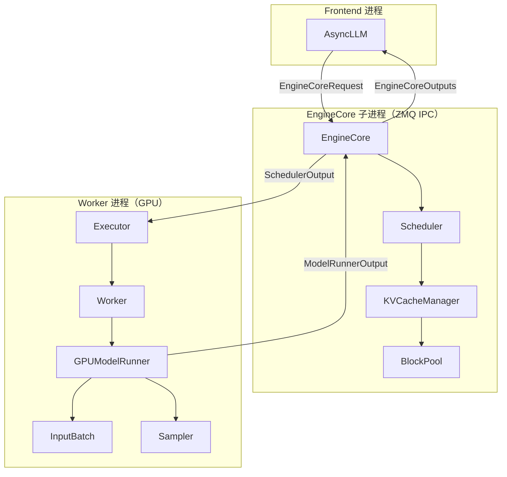
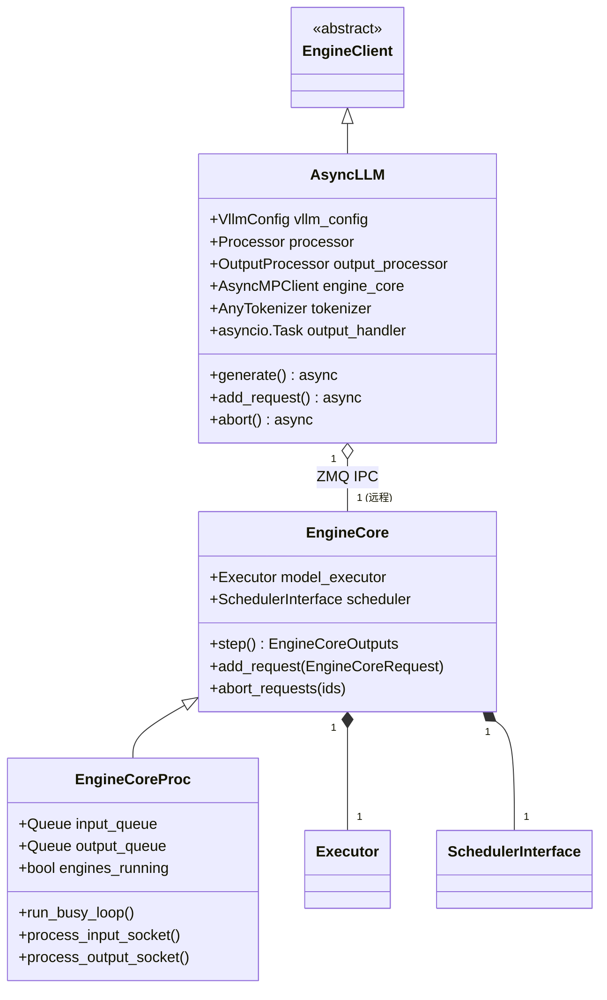
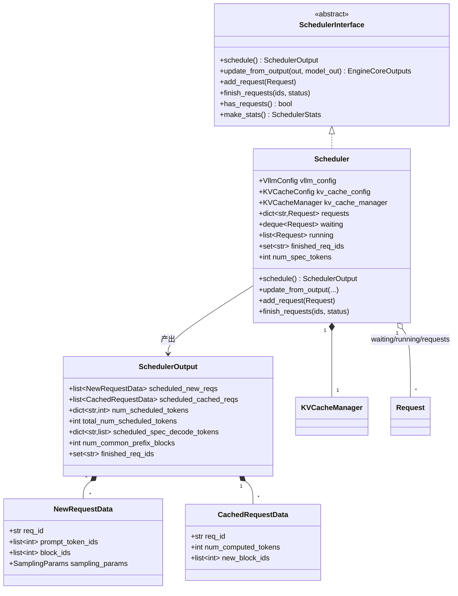
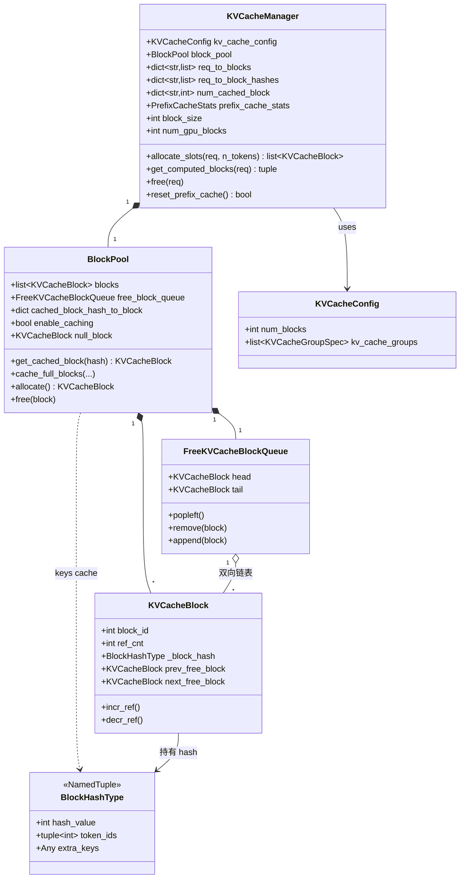
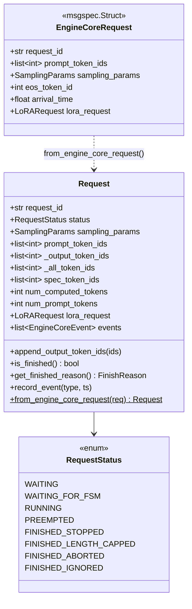
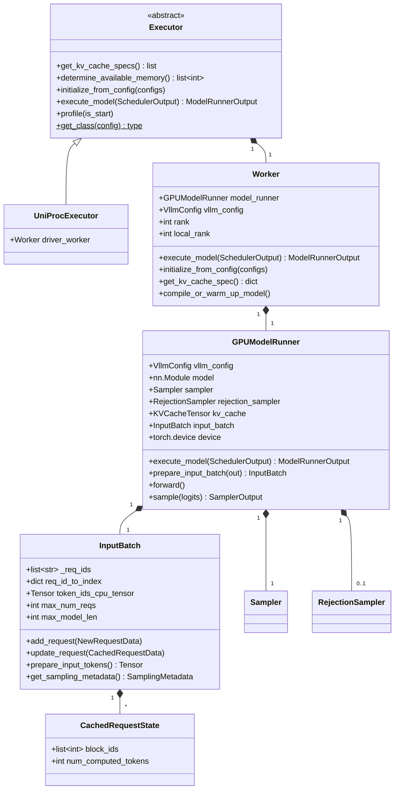
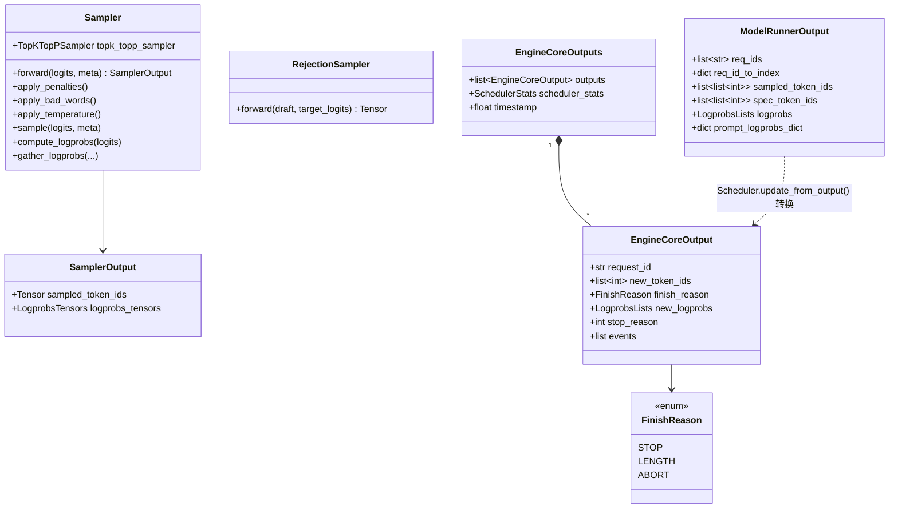
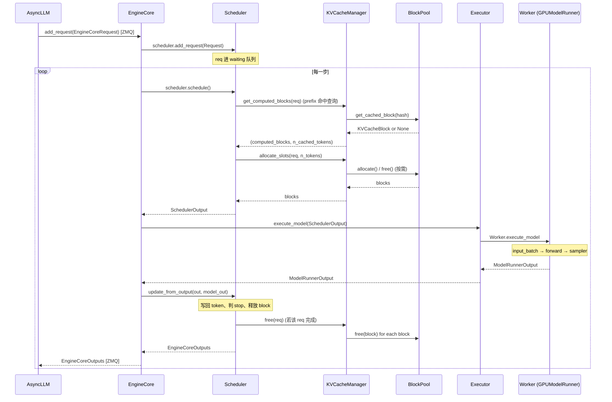

# vLLM V1 引擎核心类关系图

> **适用版本**：vLLM **v0.8.5**（仓库当前 detached HEAD）
> **范围**：仅覆盖**单机单卡 + 纯文本模型**的主线代码路径
> **不包含**（已主动剔除，避免初学时干扰）：
> - 多模态（vision/audio encoder、`EncoderCacheManager`、`mm_*` 字段）
> - 分布式推理（DP / TP / PP、Ray、`MultiprocExecutor`、`KVConnector`、pipeline batch queue）
>
> 后续要复习这些主题时再补一份单独的文档。

聚焦 `vllm/v1/`，覆盖 **从一次 `generate()` 调用到 GPU forward 一遍** 涉及的核心类。
每张图后面都有"成员/方法速查表"，便于复习时快速定位源码。

## 目录

- [一、总览：一次 `step()` 经过哪些对象](#一总览一次-step-经过哪些对象)
- [二、Engine 层 — 谁调谁](#二engine-层--谁调谁)
- [三、Scheduling 层 — Scheduler / SchedulerOutput](#三scheduling-层--scheduler--scheduleroutput)
- [四、KV Cache 层 — KVCacheManager / BlockPool / KVCacheBlock](#四kv-cache-层--kvcachemanager--blockpool--kvcacheblock)
- [五、Request 层 — Request / RequestStatus](#五request-层--request--requeststatus)
- [六、Executor / Worker 层](#六executor--worker-层)
- [七、Sampler / Output 数据结构](#七sampler--output-数据结构)
- [八、调用时序：一次 `EngineCore.step()`](#八调用时序一次-enginecorestep)
- [九、速查表 — 类与文件位置](#九速查表--类与文件位置)

---

## 一、总览：一次 `step()` 经过哪些对象



**记忆口诀**：`Frontend → EngineCore → Scheduler ⇄ KVCacheManager ⇄ BlockPool` + `Executor → Worker → ModelRunner → Sampler`。

---

## 二、Engine 层 — 谁调谁



**关键点**

- [AsyncLLM](../vllm/v1/engine/async_llm.py) 跑在前端进程，**不直接持有 `EngineCore`**，而是通过 `AsyncMPClient`（ZMQ）跟它通信。
- [EngineCore](../vllm/v1/engine/core.py) 跑在子进程，是**真正的 inner loop**。`step()` = schedule → execute → update。
- `EngineCoreProc` 在 `EngineCore` 上加了 ZMQ socket 处理，把它包装成可以被 spawn 的子进程入口。

---

## 三、Scheduling 层 — Scheduler / SchedulerOutput



**`schedule()` 三件事**：

1. **挑请求**：从 `waiting` 队头按 FCFS 取，按 token budget 决定本步处理多少 token。
2. **要内存**：调 `kv_cache_manager.allocate_slots(...)`，没空间就把 `running` 末尾的请求 **preempt** 回 `waiting`。
3. **打包**：把"新请求完整状态"（`NewRequestData`）和"老请求 delta"（`CachedRequestData`）打成 `SchedulerOutput` 发给 worker。

> **新 vs 缓存**：第一次进来的请求需要发完整 prompt token + block ids（`NewRequestData`）；后续步的请求只发增量（`CachedRequestData`），节约 IPC 带宽。

---

## 四、KV Cache 层 — KVCacheManager / BlockPool / KVCacheBlock



**两套数据结构同时维护一个 block**：

| 视角 | 数据结构 | 作用 |
|---|---|---|
| **空闲表** | `FreeKVCacheBlockQueue`（双向链表） | 决定 LRU 驱逐顺序 |
| **缓存表** | `cached_block_hash_to_block: dict[hash → {id → block}]` | prefix cache 命中查找 |

block 在两边的状态：
- `ref_cnt > 0`：在用，**只在缓存表里**。
- `ref_cnt == 0` 且 `_block_hash != None`：**两边都在**（既能被复用，也能被驱逐）。
- `ref_cnt == 0` 且 `_block_hash == None`：纯空闲，**只在空闲表里**。

---

## 五、Request 层 — Request / RequestStatus



**两个 Request 别搞混**：

- [EngineCoreRequest](../vllm/v1/engine/__init__.py)：**前端 → EngineCore 的 IPC 消息**，纯 msgspec.Struct，可序列化。
- [Request](../vllm/v1/request.py)：**Scheduler 内部的工作对象**，可变状态，跟 KV blocks / 事件绑定。

`EngineCore.add_request()` 收到前者，调用 `Request.from_engine_core_request(...)` 转成后者，扔进 `scheduler.waiting`。

### Request 状态机

```
                add_request()
                     │
                     ▼
                ┌─────────┐
                │ WAITING │
                └────┬────┘
                     │ schedule()
                     ▼
                ┌─────────┐ ◄─── 内存不够时 ────┐
                │ RUNNING │                    │
                └────┬────┘                    │
        ┌────────────┼─────────────┐           │
        │            │             │           │
        │            ▼             ▼           │
        │  ┌───────────────┐  ┌───────────┐   │
        │  │FINISHED_STOPPED│  │ PREEMPTED │ ──┘
        │  │FINISHED_LENGTH│   └───────────┘
        │  └───────────────┘
        ▼
  FINISHED_ABORTED  (client 断开)
```

---

## 六、Executor / Worker 层

> 本节只画 **`UniProcExecutor`（单进程单卡）** 这条路径。
> 多卡场景的 `MultiprocExecutor` / Ray Executor / 跨机 Worker 已剔除，单独看分布式文档。



**`execute_model()` 的执行链**（一次 forward 经过的对象）：

```
Executor.execute_model(SchedulerOutput)
  → Worker.execute_model(SchedulerOutput)
      → GPUModelRunner.execute_model(SchedulerOutput)
          1. input_batch.add_request / update_request    (按 SchedulerOutput 改 batch)
          2. input_batch.prepare_input_tokens()          (拼输入张量)
          3. self.model(...)                              (forward)
          4. self.sampler(logits, sampling_metadata)     (采样)
          5. 返回 ModelRunnerOutput
```

---

## 七、Sampler / Output 数据结构



**输出数据流**：`SamplerOutput`（GPU tensor）→ `ModelRunnerOutput`（每请求 list）→ `EngineCoreOutput`（每请求增量）→ `EngineCoreOutputs`（一步全部）→ ZMQ 回 frontend → `RequestOutput`。

---

## 八、调用时序：一次 `EngineCore.step()`



---

## 九、速查表 — 类与文件位置

### Engine

| 类 | 位置 |
|---|---|
| [AsyncLLM](../vllm/v1/engine/async_llm.py) | `vllm/v1/engine/async_llm.py` |
| [EngineCore](../vllm/v1/engine/core.py) | `vllm/v1/engine/core.py` |
| [EngineCoreProc](../vllm/v1/engine/core.py) | `vllm/v1/engine/core.py` |
| [EngineCoreRequest](../vllm/v1/engine/__init__.py) | `vllm/v1/engine/__init__.py` |
| [EngineCoreOutput / Outputs / FinishReason](../vllm/v1/engine/__init__.py) | `vllm/v1/engine/__init__.py` |

### Scheduling

| 类 | 位置 |
|---|---|
| [SchedulerInterface](../vllm/v1/core/sched/interface.py) | `vllm/v1/core/sched/interface.py` |
| [Scheduler](../vllm/v1/core/sched/scheduler.py) | `vllm/v1/core/sched/scheduler.py` |
| [SchedulerOutput / NewRequestData / CachedRequestData](../vllm/v1/core/sched/output.py) | `vllm/v1/core/sched/output.py` |

### KV Cache

| 类 | 位置 |
|---|---|
| [KVCacheManager](../vllm/v1/core/kv_cache_manager.py) | `vllm/v1/core/kv_cache_manager.py` |
| [BlockPool / FreeKVCacheBlockQueue](../vllm/v1/core/block_pool.py) | `vllm/v1/core/block_pool.py` |
| [KVCacheBlock / BlockHashType](../vllm/v1/core/kv_cache_utils.py) | `vllm/v1/core/kv_cache_utils.py` |
| [KVCacheConfig / KVCacheSpec](../vllm/v1/kv_cache_interface.py) | `vllm/v1/kv_cache_interface.py` |

### Request

| 类 | 位置 |
|---|---|
| [Request / RequestStatus](../vllm/v1/request.py) | `vllm/v1/request.py` |

### Executor / Worker

| 类 | 位置 |
|---|---|
| [Executor (abstract)](../vllm/v1/executor/abstract.py) | `vllm/v1/executor/abstract.py` |
| `UniProcExecutor` | `vllm/v1/executor/uniproc_executor.py` |
| [Worker](../vllm/v1/worker/gpu_worker.py) | `vllm/v1/worker/gpu_worker.py` |
| [GPUModelRunner](../vllm/v1/worker/gpu_model_runner.py) | `vllm/v1/worker/gpu_model_runner.py` |
| [InputBatch / CachedRequestState](../vllm/v1/worker/gpu_input_batch.py) | `vllm/v1/worker/gpu_input_batch.py` |

### Sampler / Output

| 类 | 位置 |
|---|---|
| [Sampler](../vllm/v1/sample/sampler.py) | `vllm/v1/sample/sampler.py` |
| [RejectionSampler](../vllm/v1/sample/rejection_sampler.py) | `vllm/v1/sample/rejection_sampler.py` |
| [SamplingMetadata](../vllm/v1/sample/metadata.py) | `vllm/v1/sample/metadata.py` |
| [ModelRunnerOutput / SamplerOutput](../vllm/v1/outputs.py) | `vllm/v1/outputs.py` |

---

## 复习要点

1. **进程边界**：Frontend ⇄ EngineCore 走 ZMQ；EngineCore ⇄ Worker 在单卡 `UniProcExecutor` 里是同进程直接调用。跨边界要序列化（`EngineCoreRequest` / `SchedulerOutput`）。
2. **`Scheduler` 唯一持有 `KVCacheManager`**，`KVCacheManager` 唯一持有 `BlockPool`。所有 KV 分配/释放都要从 Scheduler 这条线走。
3. **block 状态由 `ref_cnt + _block_hash` 决定**，参考"四"节末尾那张表。
4. **`InputBatch` 是 GPU 端的对端**：scheduler 出 `SchedulerOutput`，runner 把它消费成 `InputBatch`，再喂模型。
5. **两个 Request 别混**：`EngineCoreRequest` 是 IPC 消息（msgspec），`Request` 是 Scheduler 内部可变工作对象。
